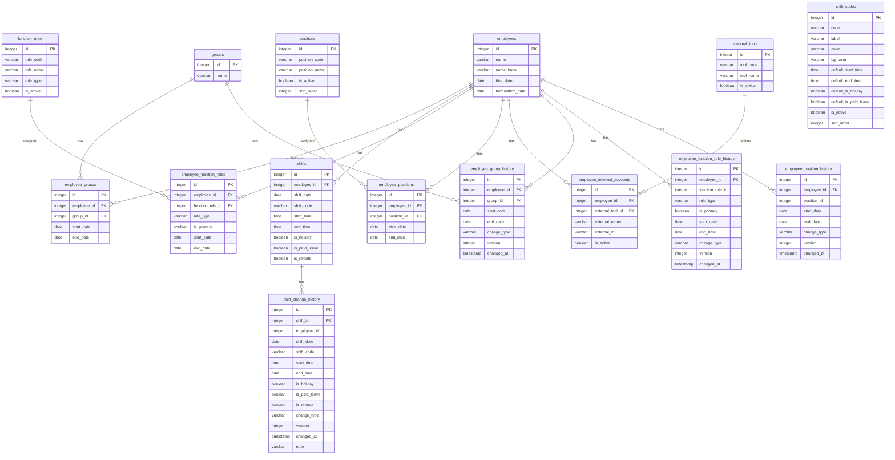

# my_database スキーマ定義書 v12

## 概要

シフト管理システム用のPostgreSQLデータベース。従業員、グループ、シフト情報に加え、機能役割・役職・外部ツール連携を管理する。従業員とグループ・役職・機能役割の関係は中間テーブルで管理し、複数所属・履歴管理に対応する。各種変更時の履歴をトリガーで自動記録し、変更前後の比較・復元を可能にする。

## ER図



---

## テーブル一覧

| テーブル名 | 説明 | 分類 |
|-----------|------|------|
| groups | グループマスタ | マスタ |
| employees | 従業員マスタ | マスタ |
| employee_groups | 従業員グループ（中間テーブル） | 中間 |
| shifts | シフトデータ | データ |
| function_roles | 機能役割マスタ（役職含む） | マスタ |
| employee_function_roles | 従業員機能役割（中間テーブル） | 中間 |
| positions | 役職マスタ | マスタ |
| employee_positions | 従業員役職（中間テーブル） | 中間 |
| external_tools | 外部ツールマスタ | マスタ |
| employee_external_accounts | 従業員外部アカウント | 中間 |
| shift_change_history | シフト変更履歴 | 履歴 |
| employee_group_history | 従業員グループ変更履歴 | 履歴 |
| employee_function_role_history | 従業員機能役割変更履歴 | 履歴 |
| employee_position_history | 従業員役職変更履歴 | 履歴 |
| shift_codes | シフトコードマスタ | マスタ |

---

## テーブル詳細

### 1. groups（グループマスタ）

従業員が所属するグループを管理する。

| カラム名 | データ型 | NULL | デフォルト | 説明 |
|---------|---------|------|-----------|------|
| id | SERIAL | NO | auto_increment | 主キー |
| name | VARCHAR(50) | NO | - | グループ名（ユニーク） |

**制約**: PK(id), UNIQUE(name)

---

### 2. employees（従業員マスタ）

従業員の基本情報を管理する。グループとの紐付けは `employee_groups` 中間テーブルで管理する。

| カラム名 | データ型 | NULL | デフォルト | 説明 |
|---------|---------|------|-----------|------|
| id | SERIAL | NO | auto_increment | 主キー |
| name | VARCHAR(100) | NO | - | 従業員名 |
| name_kana | VARCHAR(100) | YES | - | 従業員名（カナ） |
| hire_date | DATE | YES | - | 入社日 |
| termination_date | DATE | YES | - | 退職日（在籍中はNULL） |

**制約**: PK(id)

**在籍者抽出クエリ例**:
```sql
-- 特定日時点の在籍者
SELECT * FROM employees
WHERE hire_date <= :対象日
  AND (termination_date IS NULL OR termination_date >= :対象日)
```

---

### 3. employee_groups（従業員グループ）

従業員とグループの紐付けを管理する中間テーブル。履歴管理対応（`start_date` / `end_date`）。1人の従業員が複数グループに所属可能。

| カラム名 | データ型 | NULL | デフォルト | 説明 |
|---------|---------|------|-----------|------|
| id | SERIAL | NO | auto_increment | 主キー |
| employee_id | INTEGER | NO | - | 従業員ID |
| group_id | INTEGER | NO | - | グループID |
| start_date | DATE | NO | - | 開始日 |
| end_date | DATE | YES | - | 終了日（現行はNULL） |

**制約**:
- PK(id)
- FK(employee_id → employees.id) ON DELETE RESTRICT
- FK(group_id → groups.id) ON DELETE RESTRICT

**従業員の現行グループ取得クエリ例**:
```sql
SELECT e.id, e.name, g.name AS group_name
FROM employees e
JOIN employee_groups eg ON e.id = eg.employee_id AND eg.end_date IS NULL
JOIN groups g ON eg.group_id = g.id
ORDER BY g.id, e.id;
```

---

### 4. shifts（シフトデータ）

従業員の日々のシフト情報を管理する。

| カラム名 | データ型 | NULL | デフォルト | 説明 |
|---------|---------|------|-----------|------|
| id | SERIAL | NO | auto_increment | 主キー |
| employee_id | INTEGER | YES | - | 従業員ID |
| shift_date | DATE | NO | - | シフト日付 |
| shift_code | VARCHAR(20) | YES | - | シフトコード |
| start_time | TIME(6) | YES | - | 開始時刻 |
| end_time | TIME(6) | YES | - | 終了時刻 |
| is_holiday | BOOLEAN | YES | false | 休日フラグ |
| is_paid_leave | BOOLEAN | YES | false | 有給休暇フラグ |
| is_remote | BOOLEAN | NO | false | テレワークフラグ |

**制約**: PK(id), FK(employee_id → employees.id) ON DELETE SET NULL, UNIQUE(employee_id, shift_date)

**テレワーク集計クエリ例**:
```sql
-- 従業員別・勤務形態別の出勤日数
SELECT
  e.name,
  g.name AS group_name,
  SUM(CASE WHEN s.is_remote = true THEN 1 ELSE 0 END) AS テレワーク日数,
  SUM(CASE WHEN s.is_remote = false THEN 1 ELSE 0 END) AS 出社日数
FROM shifts s
JOIN employees e ON s.employee_id = e.id
LEFT JOIN employee_groups eg ON e.id = eg.employee_id AND eg.end_date IS NULL
LEFT JOIN groups g ON eg.group_id = g.id
WHERE s.start_time IS NOT NULL  -- 出勤日のみ
  AND s.shift_date BETWEEN :開始日 AND :終了日
GROUP BY e.id, e.name, g.name
ORDER BY g.id, e.id;
```

---

### 5. function_roles（機能役割マスタ）

機能役割（受付、二次対応、SVなど）および役職（副部長、課長など）を統合管理する。`role_type` により業務上の機能役割、監督権限、役職を分類する。

| カラム名 | データ型 | NULL | デフォルト | 説明 |
|---------|---------|------|-----------|------|
| id | SERIAL | NO | auto_increment | 主キー |
| role_code | VARCHAR(20) | NO | - | 役割コード（UKETSUKE / SV / KACHO等） |
| role_name | VARCHAR(50) | NO | - | 役割名（受付 / SV / 課長等） |
| role_type | VARCHAR(20) | NO | 'FUNCTION' | 役割分類（FUNCTION: 業務役割 / AUTHORITY: 監督権限 / POSITION: 役職） |
| is_active | BOOLEAN | YES | true | 有効フラグ |

**制約**: PK(id), UNIQUE(role_code)

**role_type の分類**:

| role_type | 説明 | 対象 |
|-----------|------|------|
| FUNCTION | 業務上の機能役割 | 受付、二次対応 |
| AUTHORITY | 監督権限 | SV |
| POSITION | 役職 | 副部長、課長 |

**制約の効果**: `employee_function_roles` 側のカテゴリ重複防止制約と連携し、同一カテゴリ（同一 `role_type`）の役割を同時に保持できないようにする。これにより「受付 + 二次対応」の同時保持は不可だが、「受付 + SV」や「受付 + 課長」の組み合わせは許可される。役職も同様に、同時に複数の役職を持つことはできない。

**現在のデータ**:
| id | role_code | role_name | role_type |
|----|-----------|-----------|-----------|
| 1 | UKETSUKE | 受付 | FUNCTION |
| 2 | NIJI | 二次対応 | FUNCTION |
| 3 | SV | SV | AUTHORITY |
| 4 | FUKUBUCHO | 副部長 | POSITION |
| 5 | KACHO | 課長 | POSITION |

---

### 6. employee_function_roles（従業員機能役割）

従業員と機能役割・役職の紐付けを管理する。履歴管理対応。`role_type` は `function_roles` からトリガーで自動設定される非正規化カラム。

| カラム名 | データ型 | NULL | デフォルト | 説明 |
|---------|---------|------|-----------|------|
| id | SERIAL | NO | auto_increment | 主キー |
| employee_id | INTEGER | YES | - | 従業員ID |
| function_role_id | INTEGER | YES | - | 機能役割ID |
| role_type | VARCHAR(20) | NO | 'FUNCTION' | 役割分類（function_rolesから自動設定） |
| is_primary | BOOLEAN | YES | false | 主担当フラグ |
| start_date | DATE | YES | - | 開始日 |
| end_date | DATE | YES | - | 終了日 |

**制約**:
- PK(id)
- FK(employee_id → employees.id) ON DELETE SET NULL
- FK(function_role_id → function_roles.id) ON DELETE SET NULL
- **部分ユニークインデックス①**: `(employee_id, function_role_id) WHERE end_date IS NULL` — 同一従業員で同一役割の現行レコードは1件のみ
- **部分ユニークインデックス②（カテゴリ重複防止）**: `(employee_id, role_type) WHERE end_date IS NULL` — 同一従業員で同一カテゴリ（role_type）の現行レコードは1件のみ

**カテゴリ重複防止制約の効果**:

| 操作 | 結果 | 理由 |
|------|------|------|
| 受付を持つ人に二次対応を追加 | **ブロック** | 両方 `role_type='FUNCTION'`、重複 |
| 受付を持つ人にSVを追加 | **許可** | `FUNCTION` + `AUTHORITY`、重複なし |
| 二次対応を持つ人にSVを追加 | **許可** | `FUNCTION` + `AUTHORITY`、重複なし |
| SVを持つ人にさらにSVを追加 | **ブロック** | `AUTHORITY` が重複 |
| 課長を持つ人に受付を追加 | **許可** | `POSITION` + `FUNCTION`、重複なし |
| 課長を持つ人にSVを追加 | **許可** | `POSITION` + `AUTHORITY`、重複なし |
| 課長を持つ人に副部長を追加 | **ブロック** | 両方 `role_type='POSITION'`、重複 |

**トリガー: role_type 自動設定**:

`employee_function_roles` への INSERT / UPDATE 時に、`function_roles.role_type` の値を自動的に `employee_function_roles.role_type` にコピーする。

```sql
CREATE OR REPLACE FUNCTION set_efr_role_type()
RETURNS TRIGGER AS $$
BEGIN
  SELECT role_type INTO NEW.role_type
  FROM function_roles
  WHERE id = NEW.function_role_id;
  RETURN NEW;
END;
$$ LANGUAGE plpgsql;

CREATE TRIGGER trg_efr_set_role_type
BEFORE INSERT OR UPDATE OF function_role_id
ON employee_function_roles
FOR EACH ROW
EXECUTE FUNCTION set_efr_role_type();
```

**SV一覧クエリ例**:
```sql
SELECT e.id, e.name, g.name AS group_name
FROM employees e
JOIN employee_function_roles efr ON e.id = efr.employee_id AND efr.end_date IS NULL
JOIN function_roles fr ON efr.function_role_id = fr.id
LEFT JOIN employee_groups eg ON e.id = eg.employee_id AND eg.end_date IS NULL
LEFT JOIN groups g ON eg.group_id = g.id
WHERE fr.role_code = 'SV'
ORDER BY g.id, e.id
```

---

### 7. shift_codes（シフトコードマスタ）

シフトコードのマスタ情報を管理する。各コードにデフォルトの時刻・フラグを設定でき、シフト作成時のドロップダウン選択で自動入力される。`shifts.shift_code` にFKは張らず、カスタム入力も許容する。

| カラム名 | データ型 | NULL | デフォルト | 説明 |
|---------|---------|------|-----------|------|
| id | SERIAL | NO | auto_increment | 主キー |
| code | VARCHAR(20) | NO | - | シフトコード（ユニーク） |
| label | VARCHAR(50) | NO | - | 表示ラベル |
| color | VARCHAR(50) | NO | 'text-gray-800' | Tailwind文字色クラス |
| bg_color | VARCHAR(50) | NO | 'bg-gray-100' | Tailwind背景色クラス |
| default_start_time | TIME(6) | YES | - | デフォルト開始時刻 |
| default_end_time | TIME(6) | YES | - | デフォルト終了時刻 |
| default_is_holiday | BOOLEAN | NO | false | デフォルト休日フラグ |
| default_is_paid_leave | BOOLEAN | NO | false | デフォルト有給フラグ |
| is_active | BOOLEAN | YES | true | 有効フラグ |
| sort_order | INTEGER | NO | 0 | 表示順 |

**制約**: PK(id), UNIQUE(code), INDEX(is_active, sort_order)

---

### 8. positions（役職マスタ）

役職（副部長、課長など）を管理する。`function_roles` の `role_type='POSITION'` とは独立した役職マスタとして機能する。

| カラム名 | データ型 | NULL | デフォルト | 説明 |
|---------|---------|------|-----------|------|
| id | SERIAL | NO | auto_increment | 主キー |
| position_code | VARCHAR(20) | NO | - | 役職コード（ユニーク） |
| position_name | VARCHAR(50) | NO | - | 役職名 |
| is_active | BOOLEAN | YES | true | 有効フラグ |
| sort_order | INTEGER | NO | 0 | 表示順 |

**制約**: PK(id), UNIQUE(position_code)

---

### 9. employee_positions（従業員役職）

従業員と役職の紐付けを管理する中間テーブル。EXCLUDE制約により同一従業員の期間重複を禁止する。

| カラム名 | データ型 | NULL | デフォルト | 説明 |
|---------|---------|------|-----------|------|
| id | SERIAL | NO | auto_increment | 主キー |
| employee_id | INTEGER | NO | - | 従業員ID |
| position_id | INTEGER | NO | - | 役職ID |
| start_date | DATE | NO | - | 開始日 |
| end_date | DATE | YES | - | 終了日（現行はNULL） |

**制約**:
- PK(id)
- FK(employee_id → employees.id) ON DELETE RESTRICT
- FK(position_id → positions.id) ON DELETE RESTRICT
- **EXCLUDE制約**: `EXCLUDE USING GiST (employee_id WITH =, daterange(start_date, COALESCE(end_date, '9999-12-31'::date), '[)') WITH &&)` — 同一従業員の期間重複を禁止（btree_gist拡張が必要）

---

### 10. external_tools（外部ツールマスタ）

外部ツール（CTstage等）を管理する。

| カラム名 | データ型 | NULL | デフォルト | 説明 |
|---------|---------|------|-----------|------|
| id | SERIAL | NO | auto_increment | 主キー |
| tool_code | VARCHAR(50) | NO | - | ツールコード |
| tool_name | VARCHAR(100) | NO | - | ツール名 |
| is_active | BOOLEAN | YES | true | 有効フラグ |

**制約**: PK(id)

---

### 11. employee_external_accounts（従業員外部アカウント）

従業員と外部ツールアカウントの紐付けを管理する。

| カラム名 | データ型 | NULL | デフォルト | 説明 |
|---------|---------|------|-----------|------|
| id | SERIAL | NO | auto_increment | 主キー |
| employee_id | INTEGER | YES | - | 従業員ID |
| external_tool_id | INTEGER | YES | - | 外部ツールID |
| external_name | VARCHAR(100) | NO | - | 外部ツール上の表示名 |
| external_id | VARCHAR(100) | YES | - | 外部ツール上のID |
| is_active | BOOLEAN | YES | true | 有効フラグ |

**制約**: PK(id), FK(employee_id → employees.id) ON DELETE SET NULL, FK(external_tool_id → external_tools.id) ON DELETE SET NULL

---

### 12. shift_change_history（シフト変更履歴）

シフトデータの変更履歴を管理する。`shifts` テーブルへの UPDATE / DELETE 時にトリガーで自動保存する。UPDATE 時は変更があったフィールド（shift_code, start_time, end_time, is_holiday, is_paid_leave, is_remote のいずれか）が検知された場合のみ記録される。DELETE 時は常に記録される。

| カラム名 | データ型 | NULL | デフォルト | 説明 |
|---------|---------|------|-----------|------|
| id | SERIAL | NO | auto_increment | 主キー |
| shift_id | INTEGER | NO | - | 対象シフトID |
| employee_id | INTEGER | YES | - | 従業員ID（スナップショット） |
| shift_date | DATE | NO | - | シフト日付（スナップショット） |
| shift_code | VARCHAR(20) | YES | - | シフトコード（スナップショット） |
| start_time | TIME(6) | YES | - | 開始時刻（スナップショット） |
| end_time | TIME(6) | YES | - | 終了時刻（スナップショット） |
| is_holiday | BOOLEAN | YES | - | 休日フラグ（スナップショット） |
| is_paid_leave | BOOLEAN | YES | - | 有給休暇フラグ（スナップショット） |
| is_remote | BOOLEAN | YES | - | テレワークフラグ（スナップショット） |
| change_type | VARCHAR(10) | NO | - | 変更種別（'UPDATE' / 'DELETE'） |
| version | INTEGER | NO | - | バージョン番号（shift_id毎の連番） |
| changed_at | TIMESTAMP(3) | NO | CURRENT_TIMESTAMP | 変更日時 |
| note | VARCHAR(255) | YES | - | 変更理由メモ（任意） |

**制約**:
- PK(id)
- FK(shift_id → shifts.id) ON DELETE RESTRICT — 履歴がある限りシフトの削除を禁止
- UNIQUE(shift_id, version) — 同一シフトのバージョン番号は一意
- INDEX(shift_id, changed_at) — 特定シフトの履歴検索用
- INDEX(employee_id, shift_date) — 従業員・日付での履歴検索用

**トリガー: シフト変更履歴の自動記録**:

`shifts` テーブルへの UPDATE / DELETE 時にトリガーで変更前の値を `shift_change_history` に自動保存する。UPDATE 時は変更があったフィールドを検知した場合のみ記録、DELETE 時は常に記録する。

```sql
CREATE OR REPLACE FUNCTION record_shift_change()
RETURNS TRIGGER AS $$
DECLARE
  next_version integer;
BEGIN
  -- UPDATE の場合: トラッキング対象カラムに変更がある場合のみ記録
  IF TG_OP = 'UPDATE' THEN
    IF OLD.shift_code IS DISTINCT FROM NEW.shift_code
      OR OLD.start_time IS DISTINCT FROM NEW.start_time
      OR OLD.end_time IS DISTINCT FROM NEW.end_time
      OR OLD.is_holiday IS DISTINCT FROM NEW.is_holiday
      OR OLD.is_paid_leave IS DISTINCT FROM NEW.is_paid_leave
      OR OLD.is_remote IS DISTINCT FROM NEW.is_remote
    THEN
      SELECT COALESCE(MAX(version), 0) + 1 INTO next_version
      FROM shift_change_history
      WHERE shift_id = OLD.id;

      INSERT INTO shift_change_history (
        shift_id, employee_id, shift_date, shift_code,
        start_time, end_time, is_holiday, is_paid_leave, is_remote,
        change_type, version, changed_at
      ) VALUES (
        OLD.id, OLD.employee_id, OLD.shift_date, OLD.shift_code,
        OLD.start_time, OLD.end_time, OLD.is_holiday, OLD.is_paid_leave, OLD.is_remote,
        'UPDATE', next_version, CURRENT_TIMESTAMP
      );
    END IF;
    RETURN NEW;
  END IF;

  -- DELETE の場合: 常に記録
  IF TG_OP = 'DELETE' THEN
    SELECT COALESCE(MAX(version), 0) + 1 INTO next_version
    FROM shift_change_history
    WHERE shift_id = OLD.id;

    INSERT INTO shift_change_history (
      shift_id, employee_id, shift_date, shift_code,
      start_time, end_time, is_holiday, is_paid_leave, is_remote,
      change_type, version, changed_at
    ) VALUES (
      OLD.id, OLD.employee_id, OLD.shift_date, OLD.shift_code,
      OLD.start_time, OLD.end_time, OLD.is_holiday, OLD.is_paid_leave, OLD.is_remote,
      'DELETE', next_version, CURRENT_TIMESTAMP
    );
    RETURN OLD;
  END IF;

  RETURN NULL;
END;
$$ LANGUAGE plpgsql;

CREATE TRIGGER trg_shift_change_history
BEFORE UPDATE OR DELETE ON shifts
FOR EACH ROW
EXECUTE FUNCTION record_shift_change();
```

**注意**: BEFORE DELETE トリガーにより、シフト削除前に必ず履歴レコードが作成される。これと `shift_change_history.shift_id` の FK ON DELETE RESTRICT が組み合わさることで、実質的にシフトの物理削除は不可能となる（削除試行時にまず履歴が作成され、その参照がRESTRICTで削除をブロックする）。

**特定シフトの変更履歴を確認**:
```sql
SELECT version, shift_code, start_time, end_time,
       is_holiday, is_paid_leave, is_remote,
       change_type, changed_at, note
FROM shift_change_history
WHERE shift_id = :対象シフトID
ORDER BY version DESC;
```

**変更前後の比較（最新変更）**:
```sql
SELECT
  s.shift_code    AS current_code,    h.shift_code    AS previous_code,
  s.start_time    AS current_start,   h.start_time    AS previous_start,
  s.end_time      AS current_end,     h.end_time      AS previous_end,
  s.is_holiday    AS current_holiday, h.is_holiday    AS previous_holiday,
  s.is_paid_leave AS current_leave,   h.is_paid_leave AS previous_leave,
  s.is_remote     AS current_remote,  h.is_remote     AS previous_remote,
  h.changed_at    AS changed_at
FROM shifts s
JOIN shift_change_history h ON h.shift_id = s.id
WHERE s.id = :対象シフトID
  AND h.version = (SELECT MAX(version) FROM shift_change_history WHERE shift_id = s.id);
```

**復元（特定バージョンに戻す）**:
```sql
UPDATE shifts s SET
  shift_code    = h.shift_code,
  start_time    = h.start_time,
  end_time      = h.end_time,
  is_holiday    = h.is_holiday,
  is_paid_leave = h.is_paid_leave,
  is_remote     = h.is_remote
FROM shift_change_history h
WHERE h.shift_id = s.id
  AND h.shift_id = :対象シフトID
  AND h.version  = :復元先バージョン;
-- ※ この UPDATE 自体もトリガーにより履歴に記録される
```

---

### 13. employee_group_history（従業員グループ変更履歴）

`employee_groups` テーブルへの INSERT / UPDATE / DELETE 時にトリガーで自動記録される。

| カラム名 | データ型 | NULL | デフォルト | 説明 |
|---------|---------|------|-----------|------|
| id | SERIAL | NO | auto_increment | 主キー |
| employee_id | INTEGER | NO | - | 従業員ID |
| group_id | INTEGER | YES | - | グループID（スナップショット） |
| start_date | DATE | YES | - | 開始日（スナップショット） |
| end_date | DATE | YES | - | 終了日（スナップショット） |
| change_type | VARCHAR(10) | NO | - | 変更種別（'INSERT' / 'UPDATE' / 'DELETE'） |
| version | INTEGER | NO | - | バージョン番号（employee_id毎の連番） |
| changed_at | TIMESTAMP(3) | NO | CURRENT_TIMESTAMP | 変更日時 |

**制約**:
- PK(id)
- FK(employee_id → employees.id) ON DELETE RESTRICT
- FK(group_id → groups.id) ON DELETE RESTRICT
- UNIQUE(employee_id, version)
- INDEX(employee_id, changed_at)

**トリガー: グループ変更履歴の自動記録**:

```sql
CREATE OR REPLACE FUNCTION record_employee_group_change()
RETURNS TRIGGER AS $$
DECLARE
  next_version integer;
  target_employee_id integer;
BEGIN
  target_employee_id := COALESCE(NEW.employee_id, OLD.employee_id);

  SELECT COALESCE(MAX(version), 0) + 1 INTO next_version
  FROM employee_group_history
  WHERE employee_id = target_employee_id;

  IF TG_OP = 'INSERT' THEN
    INSERT INTO employee_group_history (
      employee_id, group_id, start_date, end_date, change_type, version
    ) VALUES (
      NEW.employee_id, NEW.group_id, NEW.start_date, NEW.end_date, 'INSERT', next_version
    );
    RETURN NEW;
  ELSIF TG_OP = 'UPDATE' THEN
    INSERT INTO employee_group_history (
      employee_id, group_id, start_date, end_date, change_type, version
    ) VALUES (
      OLD.employee_id, OLD.group_id, OLD.start_date, OLD.end_date, 'UPDATE', next_version
    );
    RETURN NEW;
  ELSIF TG_OP = 'DELETE' THEN
    INSERT INTO employee_group_history (
      employee_id, group_id, start_date, end_date, change_type, version
    ) VALUES (
      OLD.employee_id, OLD.group_id, OLD.start_date, OLD.end_date, 'DELETE', next_version
    );
    RETURN OLD;
  END IF;
END;
$$ LANGUAGE plpgsql;

CREATE TRIGGER trg_employee_group_change
AFTER INSERT OR UPDATE OR DELETE ON employee_groups
FOR EACH ROW
EXECUTE FUNCTION record_employee_group_change();
```

---

### 14. employee_function_role_history（従業員機能役割変更履歴）

`employee_function_roles` テーブルへの INSERT / UPDATE / DELETE 時にトリガーで自動記録される。

| カラム名 | データ型 | NULL | デフォルト | 説明 |
|---------|---------|------|-----------|------|
| id | SERIAL | NO | auto_increment | 主キー |
| employee_id | INTEGER | NO | - | 従業員ID |
| function_role_id | INTEGER | YES | - | 機能役割ID（スナップショット） |
| role_type | VARCHAR(20) | YES | - | 役割分類（スナップショット） |
| is_primary | BOOLEAN | YES | - | 主担当フラグ（スナップショット） |
| start_date | DATE | YES | - | 開始日（スナップショット） |
| end_date | DATE | YES | - | 終了日（スナップショット） |
| change_type | VARCHAR(10) | NO | - | 変更種別（'INSERT' / 'UPDATE' / 'DELETE'） |
| version | INTEGER | NO | - | バージョン番号（employee_id毎の連番） |
| changed_at | TIMESTAMP(3) | NO | CURRENT_TIMESTAMP | 変更日時 |

**制約**:
- PK(id)
- FK(employee_id → employees.id) ON DELETE RESTRICT
- UNIQUE(employee_id, version)
- INDEX(employee_id, changed_at)

**トリガー: 機能役割変更履歴の自動記録**:

```sql
CREATE OR REPLACE FUNCTION record_employee_role_change()
RETURNS TRIGGER AS $$
DECLARE
  next_version integer;
  target_employee_id integer;
BEGIN
  target_employee_id := COALESCE(NEW.employee_id, OLD.employee_id);

  SELECT COALESCE(MAX(version), 0) + 1 INTO next_version
  FROM employee_function_role_history
  WHERE employee_id = target_employee_id;

  IF TG_OP = 'INSERT' THEN
    INSERT INTO employee_function_role_history (
      employee_id, function_role_id, role_type, is_primary,
      start_date, end_date, change_type, version
    ) VALUES (
      NEW.employee_id, NEW.function_role_id, NEW.role_type, NEW.is_primary,
      NEW.start_date, NEW.end_date, 'INSERT', next_version
    );
    RETURN NEW;
  ELSIF TG_OP = 'UPDATE' THEN
    INSERT INTO employee_function_role_history (
      employee_id, function_role_id, role_type, is_primary,
      start_date, end_date, change_type, version
    ) VALUES (
      OLD.employee_id, OLD.function_role_id, OLD.role_type, OLD.is_primary,
      OLD.start_date, OLD.end_date, 'UPDATE', next_version
    );
    RETURN NEW;
  ELSIF TG_OP = 'DELETE' THEN
    INSERT INTO employee_function_role_history (
      employee_id, function_role_id, role_type, is_primary,
      start_date, end_date, change_type, version
    ) VALUES (
      OLD.employee_id, OLD.function_role_id, OLD.role_type, OLD.is_primary,
      OLD.start_date, OLD.end_date, 'DELETE', next_version
    );
    RETURN OLD;
  END IF;
END;
$$ LANGUAGE plpgsql;

CREATE TRIGGER trg_employee_role_change
AFTER INSERT OR UPDATE OR DELETE ON employee_function_roles
FOR EACH ROW
EXECUTE FUNCTION record_employee_role_change();
```

---

### 15. employee_position_history（従業員役職変更履歴）

`employee_positions` テーブルへの INSERT / UPDATE / DELETE 時にトリガーで自動記録される。

| カラム名 | データ型 | NULL | デフォルト | 説明 |
|---------|---------|------|-----------|------|
| id | SERIAL | NO | auto_increment | 主キー |
| employee_id | INTEGER | NO | - | 従業員ID |
| position_id | INTEGER | YES | - | 役職ID（スナップショット） |
| start_date | DATE | YES | - | 開始日（スナップショット） |
| end_date | DATE | YES | - | 終了日（スナップショット） |
| change_type | VARCHAR(10) | NO | - | 変更種別（'INSERT' / 'UPDATE' / 'DELETE'） |
| version | INTEGER | NO | - | バージョン番号（employee_id毎の連番） |
| changed_at | TIMESTAMP(3) | NO | CURRENT_TIMESTAMP | 変更日時 |

**制約**:
- PK(id)
- FK(employee_id → employees.id) ON DELETE RESTRICT
- UNIQUE(employee_id, version)
- INDEX(employee_id, changed_at)

**トリガー: 役職変更履歴の自動記録**:

```sql
CREATE OR REPLACE FUNCTION record_employee_position_change()
RETURNS TRIGGER AS $$
DECLARE
  next_version integer;
  target_employee_id integer;
BEGIN
  target_employee_id := COALESCE(NEW.employee_id, OLD.employee_id);

  SELECT COALESCE(MAX(version), 0) + 1 INTO next_version
  FROM employee_position_history
  WHERE employee_id = target_employee_id;

  IF TG_OP = 'INSERT' THEN
    INSERT INTO employee_position_history (
      employee_id, position_id, start_date, end_date, change_type, version
    ) VALUES (
      NEW.employee_id, NEW.position_id, NEW.start_date, NEW.end_date, 'INSERT', next_version
    );
    RETURN NEW;
  ELSIF TG_OP = 'UPDATE' THEN
    INSERT INTO employee_position_history (
      employee_id, position_id, start_date, end_date, change_type, version
    ) VALUES (
      OLD.employee_id, OLD.position_id, OLD.start_date, OLD.end_date, 'UPDATE', next_version
    );
    RETURN NEW;
  ELSIF TG_OP = 'DELETE' THEN
    INSERT INTO employee_position_history (
      employee_id, position_id, start_date, end_date, change_type, version
    ) VALUES (
      OLD.employee_id, OLD.position_id, OLD.start_date, OLD.end_date, 'DELETE', next_version
    );
    RETURN OLD;
  END IF;
END;
$$ LANGUAGE plpgsql;

CREATE TRIGGER trg_employee_position_change
AFTER INSERT OR UPDATE OR DELETE ON employee_positions
FOR EACH ROW
EXECUTE FUNCTION record_employee_position_change();
```

---

## トリガー・関数一覧

| # | トリガー名 | 対象テーブル | タイミング | 関数名 | 用途 |
|---|-----------|------------|-----------|--------|------|
| 1 | trg_efr_set_role_type | employee_function_roles | BEFORE INSERT OR UPDATE OF function_role_id | set_efr_role_type() | role_type自動設定 |
| 2 | trg_shift_change_history | shifts | BEFORE UPDATE OR DELETE | record_shift_change() | シフト変更履歴の自動記録（UPDATE時は変更検知、DELETE時は常時） |
| 3 | trg_employee_group_change | employee_groups | AFTER INSERT OR UPDATE OR DELETE | record_employee_group_change() | グループ変更履歴の自動記録 |
| 4 | trg_employee_role_change | employee_function_roles | AFTER INSERT OR UPDATE OR DELETE | record_employee_role_change() | 機能役割変更履歴の自動記録 |
| 5 | trg_employee_position_change | employee_positions | AFTER INSERT OR UPDATE OR DELETE | record_employee_position_change() | 役職変更履歴の自動記録 |

---

## リレーション

```
groups (1) ────< (N) employee_groups (N) >────(1) employees
                                                    │
                                                    ├────< (N) shifts (1) ────< (N) shift_change_history
                                                    │
                                                    ├────< (N) employee_function_roles (N) >────(1) function_roles
                                                    │
                                                    ├────< (N) employee_positions (N) >────(1) positions
                                                    │
                                                    ├────< (N) employee_external_accounts (N) >────(1) external_tools
                                                    │
                                                    ├────< (N) employee_group_history (N) >────(1) groups
                                                    │
                                                    ├────< (N) employee_function_role_history
                                                    │
                                                    └────< (N) employee_position_history
```

| 親テーブル | 子テーブル | 外部キー | 関係 | ON DELETE |
|-----------|-----------|---------|------|-----------|
| employees | employee_groups | employee_id | 1:N | RESTRICT |
| groups | employee_groups | group_id | 1:N | RESTRICT |
| employees | shifts | employee_id | 1:N | SET NULL |
| employees | employee_function_roles | employee_id | 1:N | SET NULL |
| function_roles | employee_function_roles | function_role_id | 1:N | SET NULL |
| employees | employee_positions | employee_id | 1:N | RESTRICT |
| positions | employee_positions | position_id | 1:N | RESTRICT |
| shifts | shift_change_history | shift_id | 1:N | RESTRICT |
| employees | employee_group_history | employee_id | 1:N | RESTRICT |
| groups | employee_group_history | group_id | 1:N | RESTRICT |
| employees | employee_function_role_history | employee_id | 1:N | RESTRICT |
| employees | employee_position_history | employee_id | 1:N | RESTRICT |
| employees | employee_external_accounts | employee_id | 1:N | SET NULL |
| external_tools | employee_external_accounts | external_tool_id | 1:N | SET NULL |

---

## 必要な拡張

| 拡張名 | 用途 |
|--------|------|
| btree_gist | `employee_positions` のEXCLUDE制約（GiSTインデックス）に必要 |

---

## 変更履歴

| バージョン | 日付 | 変更内容 |
|-----------|------|----------|
| v1 | 2025-01-24 | 初版作成 |
| v2 | 2025-01-25 | positions, function_roles, employee_function_roles追加。employees.role_type1/2/3を廃止しis_sv, position_idに変更。employee_external_accountsにexternal_id追加 |
| v3 | 2026-01-27 | employees.hire_date, employees.termination_date追加（入社日・退職日管理） |
| v4 | 2026-01-27 | employees.hire_dateをassignment_dateにリネーム（CSC配属日に変更） |
| v5 | 2026-01-27 | shifts.is_remote追加（テレワークフラグ） |
| v6 | 2026-02-05 | employee_name_history（従業員氏名履歴）テーブルを追加。氏名変更トリガー追加。テーブル一覧のレコード数を最新化 |
| v7 | 2026-02-07 | SV管理をfunction_rolesに統合。function_roles.role_type追加（FUNCTION/AUTHORITY分類）。employee_function_roles.role_type追加（非正規化）とカテゴリ重複防止制約。role_type自動設定トリガー追加。employees.is_svを削除 |
| v8 | 2026-02-16 | positionsを独立テーブルとして分離。employee_positions中間テーブル追加（EXCLUDE制約で期間重複防止）。role_typeにPOSITION追加。employees.position_idを削除。employee_position_history追加。employee_function_role_history追加。各種変更履歴トリガー追加 |
| v9 | 2026-02-16 | shift_change_history（シフト変更履歴）テーブルを追加。スナップショット型履歴でshiftsへのUPDATE時にトリガーで変更前の値を自動記録。バージョン管理・変更前後比較・復元クエリを含む |
| v10 | 2026-02-22 | 実DB構造と定義書の整合性を全面修正。employees.group_idを削除しemployee_groups中間テーブルに移行。employee_group_history追加（start_date/end_date対応）。positions・employee_positions・各種履歴テーブル（employee_group_history, employee_function_role_history, employee_position_history）の記載を追加。全トリガー・関数の正確なSQL記載。ER図・リレーション・テーブル一覧を15テーブル構成に更新。ON DELETE動作を全FKに明記。データ型精度（TIMESTAMP(3), TIME(6)）を反映 |
| v11 | 2026-02-23 | shift_codes（シフトコードマスタ）テーブルを追加。シフトコードのDB管理、デフォルト時刻・フラグ設定、管理画面CRUD、シフトフォームのドロップダウン化に対応。既存SHIFT_CODE_MAP（9件）をシードデータとして移行 |
| v12 | 2026-02-23 | 実DB構造との整合性修正。record_shift_change()関数がUPDATE/DELETE両方を処理するよう更新されていた実態を反映。トリガー名をtrg_shift_change→trg_shift_change_historyに修正。shift_change_historyのchange_typeに'DELETE'を追加。BEFORE DELETE + FK RESTRICT によるシフト物理削除不可の挙動を注記。セクション番号の重複(8が2つ)を修正 |
